# A11y Guard - Complete Walkthrough 🛡️

A step-by-step guide demonstrating all CLI features of A11y Guard, the AI-powered accessibility testing tool.

---

## Table of Contents
1. [Installation](#1-installation)
2. [Initialization](#2-initialization)
3. [Configuration](#3-configuration)
4. [Git Hooks](#4-git-hooks)
5. [Catching Violations](#5-catching-violations)
6. [Pre-Commit Blocking](#6-pre-commit-blocking)
7. [Interactive Fix](#7-interactive-fix)
8. [Fix Applied](#8-fix-applied)
9. [Ask Command](#9-ask-command)
10. [Analyze Command](#10-analyze-command)
11. [Learn from Commits](#11-learn-from-commits)

---

## 1. Installation

Install A11y Guard globally via npm:

```bash
npm install -g @democratize-quality/a11y-guard
```

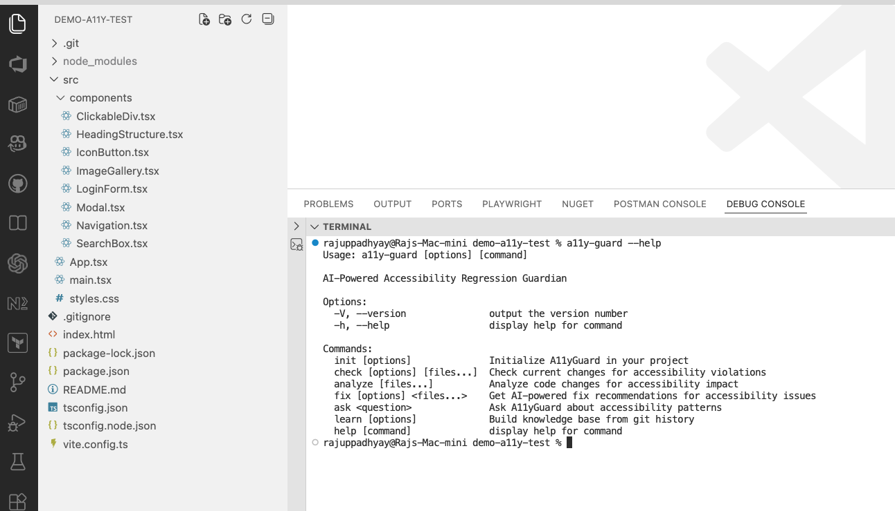

The package installs the `a11y-guard` CLI globally, making it available in any project.

---

## 2. Initialization

Initialize A11y Guard in your project:

```bash
a11y-guard init
```

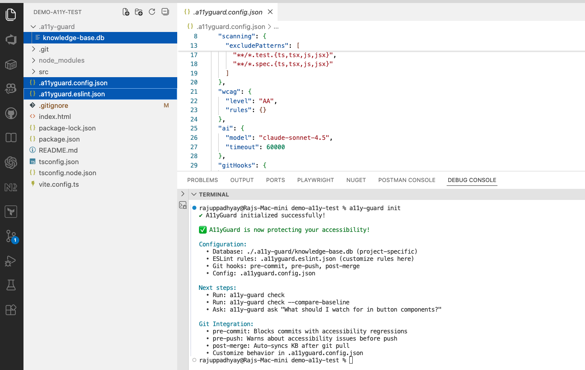

The `init` command sets up everything you need:
- ✅ Creates `.a11y-guard/` directory with SQLite knowledge base
- ✅ Generates `.a11yguard.config.json` configuration file
- ✅ Installs Git hooks for automated scanning
- ✅ Updates `.gitignore` to exclude the database

---

## 3. Configuration

The initialization creates `.a11yguard.config.json` with sensible defaults:

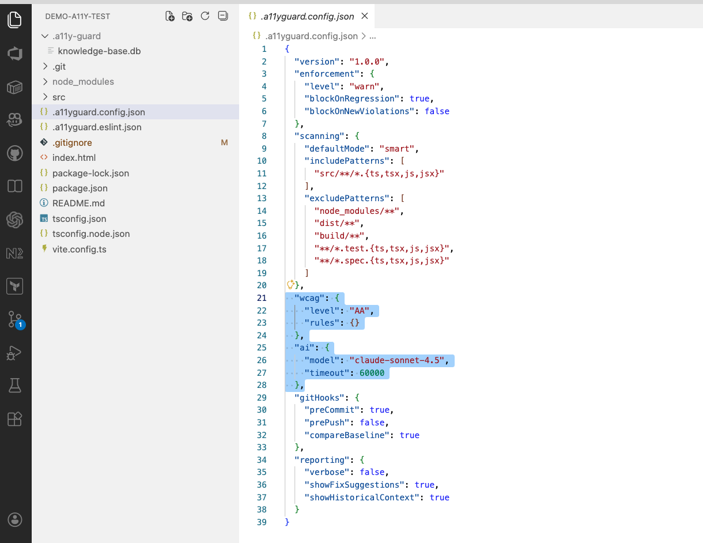

### Configuration Sections Explained

| Section | Purpose | Key Settings |
|---------|---------|--------------|
| **`version`** | Config schema version | `"1.0.0"` |
| **`enforcement`** | Control violation blocking | `blockOnRegression: true` blocks commits with new violations |
| **`scanning`** | Define scan behavior | `defaultMode: "smart"` uses AI to predict risky files |
| **`wcag`** | Accessibility standard | `level: "AA"` targets WCAG 2.1 AA compliance |
| **`ai`** | Model configuration | `model: "claude-sonnet-4.5"` for best tool handling |
| **`gitHooks`** | Automation settings | `preCommit: true` enables pre-commit scanning |
| **`reporting`** | Output preferences | `showFixSuggestions: true` displays AI-powered fixes |

### Full Configuration Reference

```json
{
  "version": "1.0.0",
  "enforcement": {
    "level": "warn",           // "warn" | "error" | "off"
    "blockOnRegression": true, // Block commits with NEW violations
    "blockOnNewViolations": false
  },
  "scanning": {
    "defaultMode": "smart",    // "static" | "smart" | "live"
    "includePatterns": ["src/**/*.{ts,tsx,js,jsx}"],
    "excludePatterns": ["node_modules/**", "dist/**", "**/*.test.*"]
  },
  "wcag": {
    "level": "AA",             // "A" | "AA" | "AAA"
    "rules": {}                // Override specific rules
  },
  "ai": {
    "model": "claude-sonnet-4.5",
    "timeout": 60000           // 60 seconds
  },
  "gitHooks": {
    "preCommit": true,         // Scan before commit
    "prePush": false,          // Scan before push
    "compareBaseline": true    // Compare against last clean state
  },
  "reporting": {
    "verbose": false,
    "showFixSuggestions": true,
    "showHistoricalContext": true
  }
}
```

---

## 4. Git Hooks

A11y Guard automatically installs Git hooks for continuous accessibility monitoring:

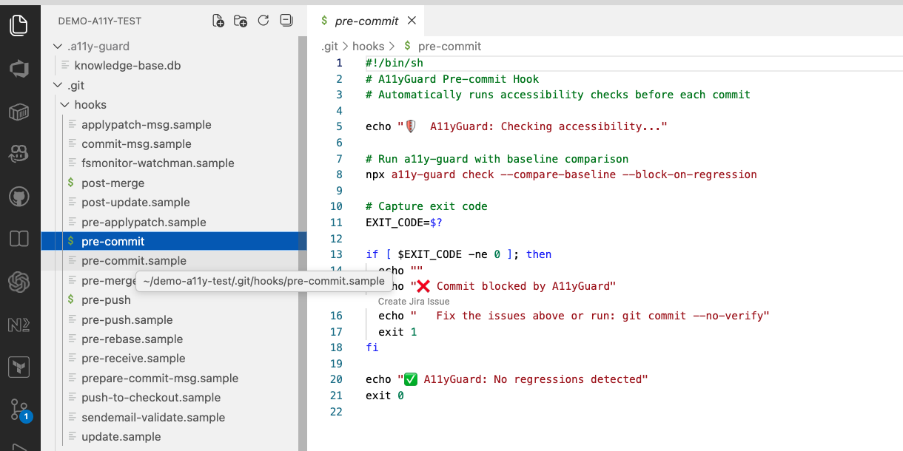

### Hooks Installed

| Hook | When It Runs | What It Does |
|------|--------------|--------------|
| **pre-commit** | Before `git commit` | Scans staged files, blocks if regressions found |
| **pre-push** | Before `git push` | Warning scan (doesn't block by default) |
| **post-merge** | After `git pull` | Auto-learns from teammate's fixes silently |

### How It Works

```
Developer A                     Developer B
    │                               │
    ├─ Fixes violation              │
    ├─ Commits fix                  │
    ├─ Pushes to remote             │
    │                               │
    │                           ├─ git pull
    │                           ├─ post-merge hook triggers
    │                           ├─ a11y-guard learn --incremental
    │                           └─ Knowledge base updated! ✨
```

---

## 5. Catching Violations

Let's introduce an accessibility violation and see A11y Guard in action.

Here's a component with a common issue - a clickable div without proper accessibility:

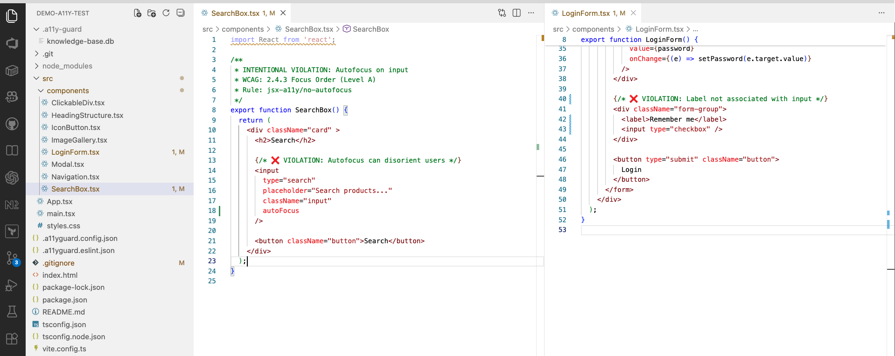

**Common violations detected:**
- Missing `alt` text on images
- Clickable elements without keyboard support
- Missing form labels
- Invalid ARIA attributes
- Heading hierarchy issues

---

## 6. Pre-Commit Blocking

When you try to commit code with accessibility violations, the pre-commit hook catches them:

```bash
git add .
git commit -m "Add new feature"
```

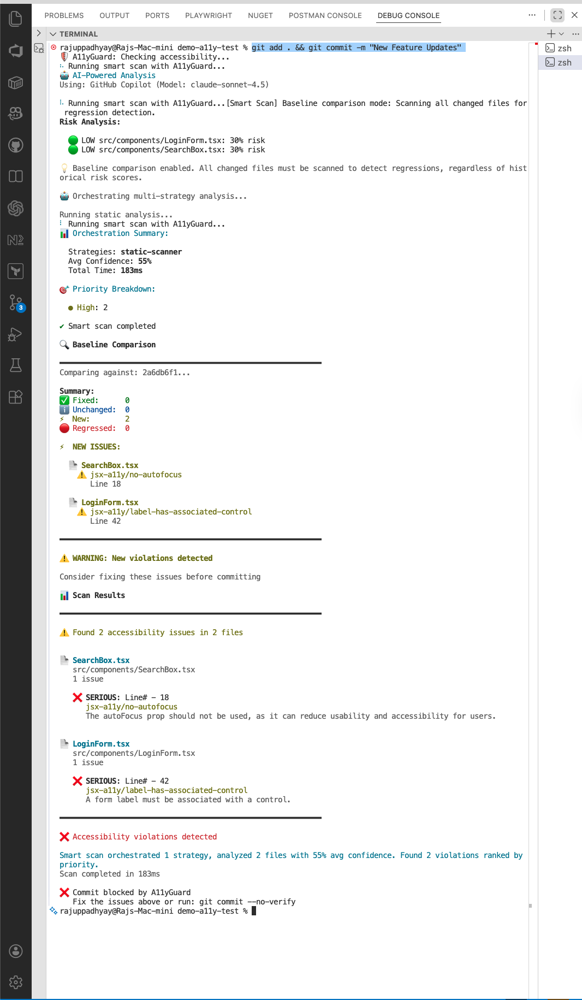

The commit is **blocked** because:
- 🚫 New accessibility violations detected
- 📊 Baseline comparison shows regression
- 🔧 Fix suggestions provided inline

**To bypass (not recommended):**
```bash
git commit --no-verify -m "Emergency fix"
```

---

## 7. Interactive Fix

A11y Guard's most powerful feature - AI-powered interactive fixes:

```bash
a11y-guard fix src/components/ClickableDiv.tsx
```

### Step 1: Analysis & Suggestion

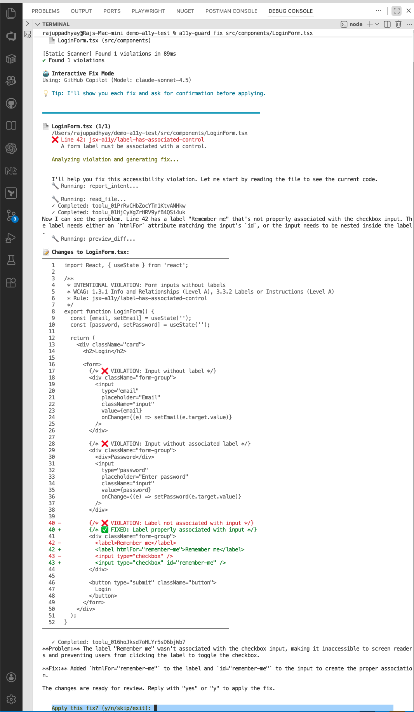

The Fix Agent:
1. 🔍 Reads your source file
2. 📚 Queries knowledge base for similar past fixes
3. 🤖 Generates context-aware solution
4. 📊 Provides confidence score

### Step 2: Review & Apply

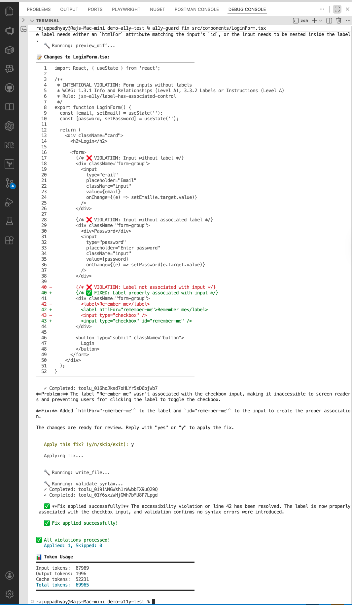

You can:
- **[Y]es** - Apply the suggested fix
- **[N]o** - Skip this suggestion
- **[E]dit** - Modify before applying
- **[Q]uit** - Exit interactive mode

---

## 8. Fix Applied

After accepting the fix:

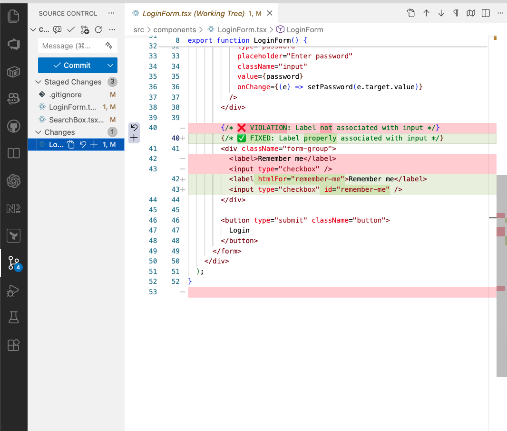

**What changed:**
- ✅ Code automatically updated
- ✅ Fix recorded in knowledge base
- ✅ Token usage displayed for transparency
- ✅ Ready to commit!

**Before:**
```tsx
<div onClick={handleClick}>Click me</div>
```

**After:**
```tsx
<button onClick={handleClick}>Click me</button>
```

---

## 9. Ask Command

Get instant WCAG guidance with natural language:

```bash
a11y-guard ask "What ARIA attributes should I use for a modal dialog?"
```

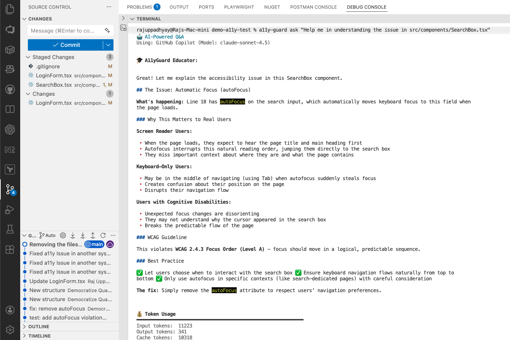

The **Educator Agent** provides:
- 📖 Clear explanations of WCAG guidelines
- 💡 Practical code examples
- 🎯 Context from your project's patterns
- 🔗 References to official documentation

**More examples:**
```bash
a11y-guard ask "How do I make a dropdown accessible?"
a11y-guard ask "What's the difference between aria-label and aria-labelledby?"
a11y-guard ask "Common accessibility issues with React forms"
```

---

## 10. Analyze Command

Understand accessibility patterns in your codebase:

```bash
a11y-guard analyze
```

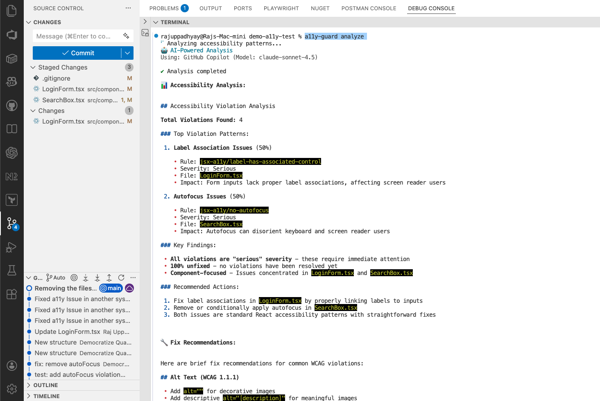

The **History Agent** reveals:
- 📊 Most common violation types
- 📈 Trends over time
- 🎯 High-risk files and components
- ✅ Fix success rates
- 💡 Recommendations based on patterns

**Use this for:**
- Sprint planning (prioritize high-impact fixes)
- Team training (identify knowledge gaps)
- Technical debt tracking

---

## 11. Learn from Commits

Build your knowledge base from git history:

```bash
a11y-guard learn --commits 50
```

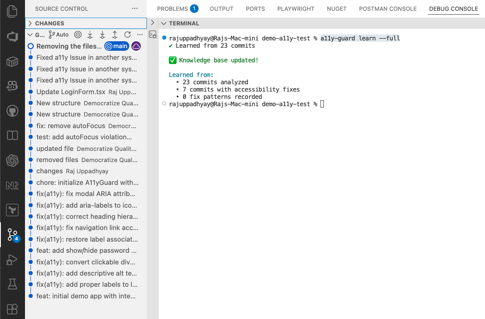

The Learn command:
1. 📜 Scans git history for accessibility-related changes
2. 🔍 Identifies violation → fix patterns
3. 💾 Stores successful fixes in knowledge base
4. 🧠 Improves future AI suggestions

**Options:**
```bash
# Learn from last N commits
a11y-guard learn --commits 100

# Full re-learn (ignore cache)
a11y-guard learn --full

# Incremental (only new commits since last learn)
a11y-guard learn --incremental
```

**Why this matters:**
- Your team's fixes improve everyone's suggestions
- Project-specific patterns are recognized
- Knowledge compounds over time

---

## Summary

A11y Guard integrates into your development workflow at every stage:

```
┌─────────────────────────────────────────────────────────────┐
│                    Development Workflow                      │
├─────────────────────────────────────────────────────────────┤
│                                                              │
│   Write Code                                                 │
│       │                                                      │
│       ▼                                                      │
│   a11y-guard check ──────► Catch violations early            │
│       │                                                      │
│       ▼                                                      │
│   a11y-guard fix ────────► AI fixes interactively           │
│       │                                                      │
│       ▼                                                      │
│   git commit ────────────► Pre-commit hook validates        │
│       │                                                      │
│       ▼                                                      │
│   git push ──────────────► Pre-push warning                 │
│       │                                                      │
│       ▼                                                      │
│   Teammate: git pull ────► Post-merge auto-learns           │
│                                                              │
└─────────────────────────────────────────────────────────────┘
```

### Quick Reference

| Command | Purpose |
|---------|---------|
| `a11y-guard init` | Initialize in project |
| `a11y-guard check` | Scan for violations |
| `a11y-guard fix <file>` | Interactive AI fixes |
| `a11y-guard ask "<question>"` | WCAG Q&A |
| `a11y-guard analyze` | Pattern analysis |
| `a11y-guard learn` | Build knowledge from git |

---

## Links

- 📦 **NPM:** [@democratize-quality/a11y-guard](https://www.npmjs.com/package/@democratize-quality/a11y-guard)
- 🐙 **GitHub:** [uppadhyayraj/a11y-guard](https://github.com/uppadhyayraj/democratizequality-a11y-guard)
- 📚 **Docs:** [README](README.md)

---

*Built with ❤️ for inclusive web development by Democratize-Quality*
